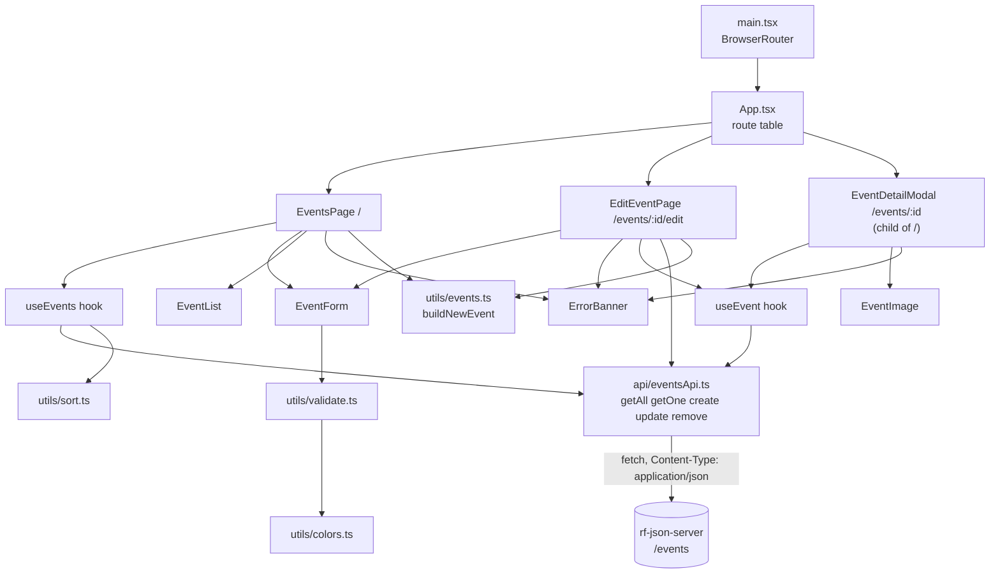
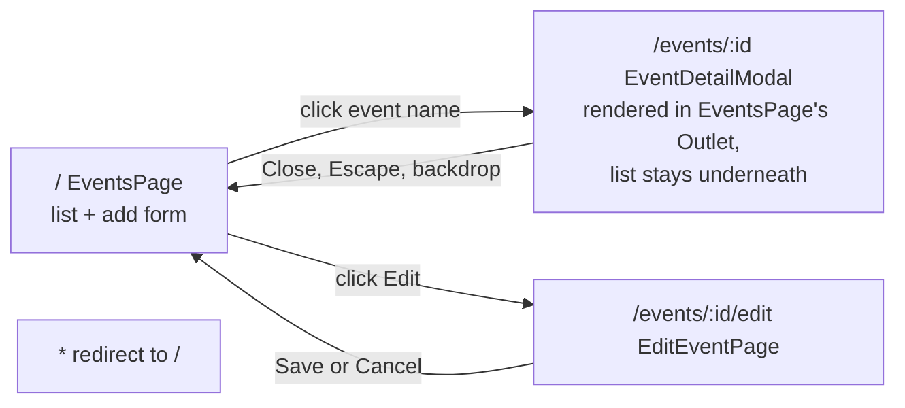
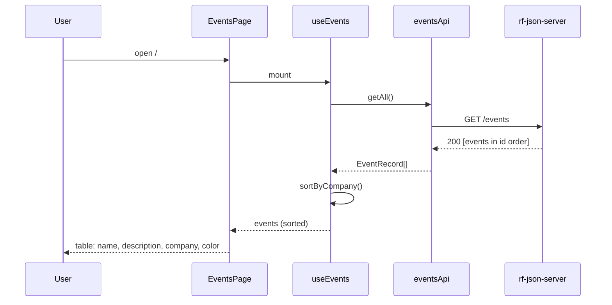
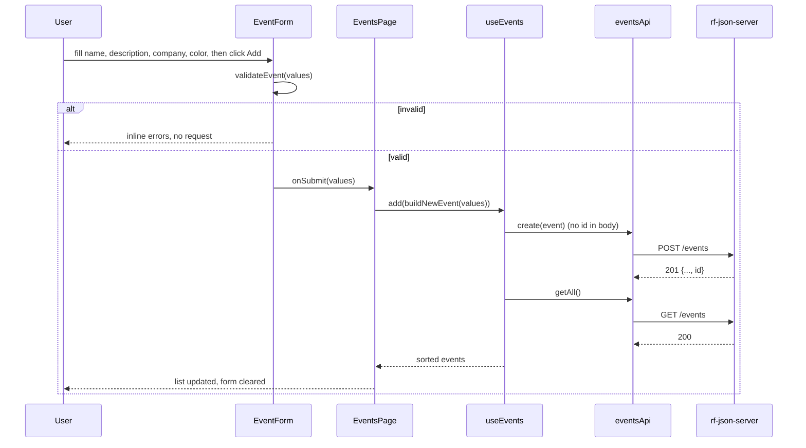
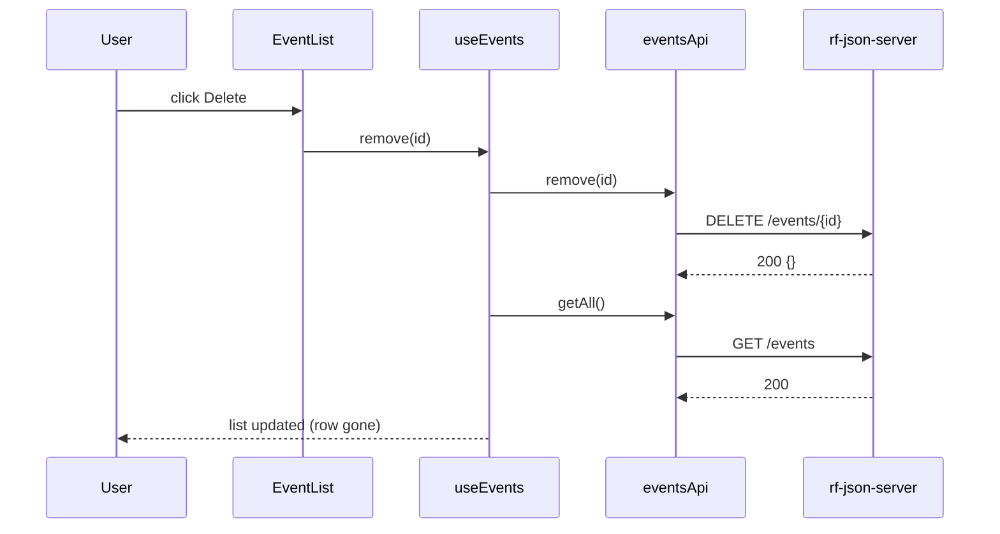
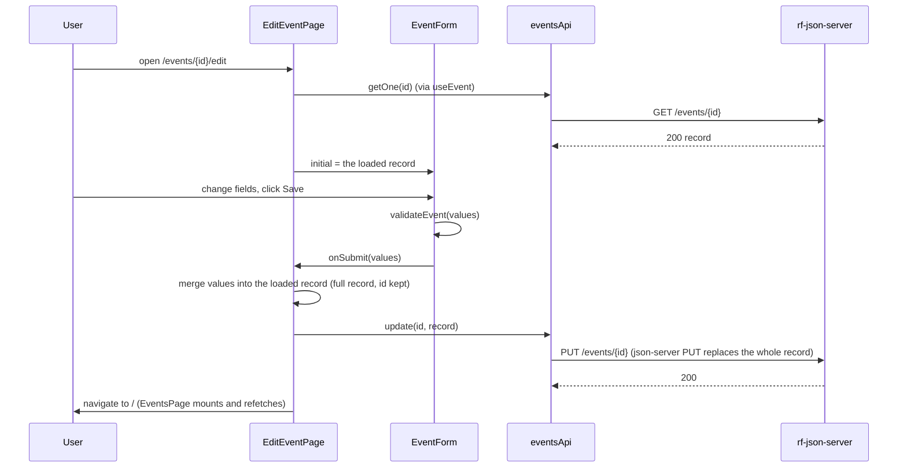
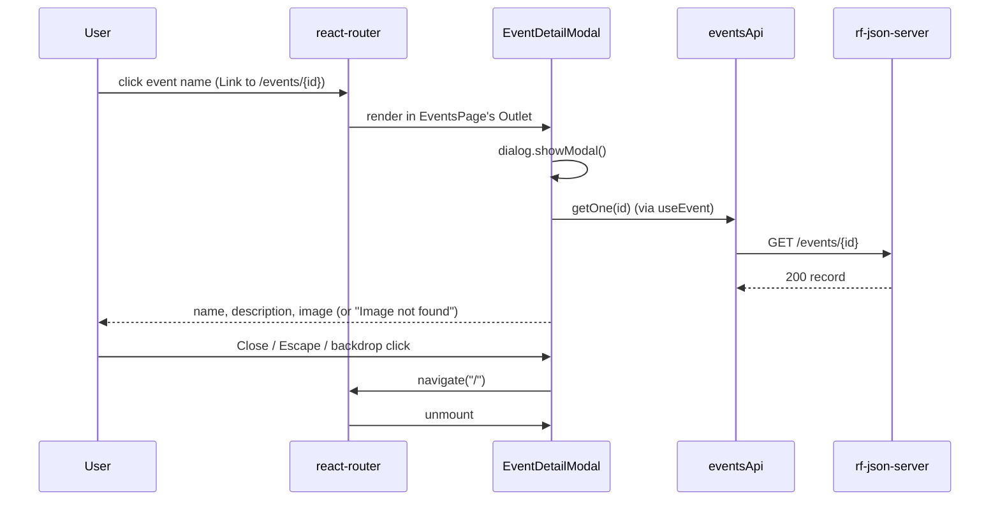
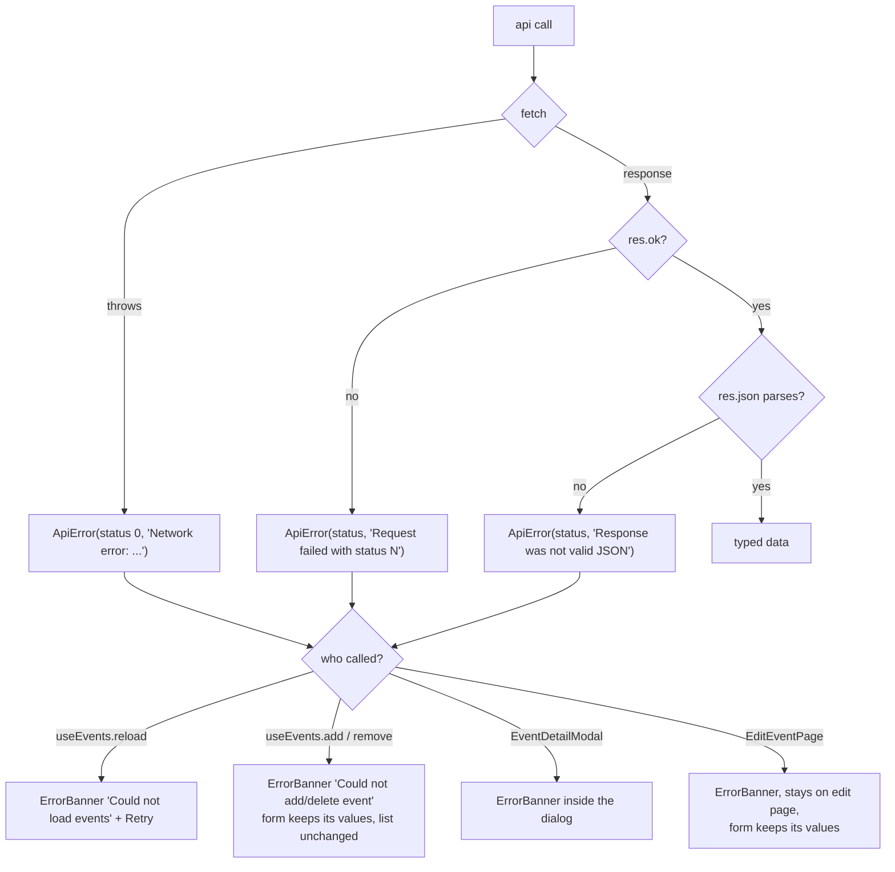
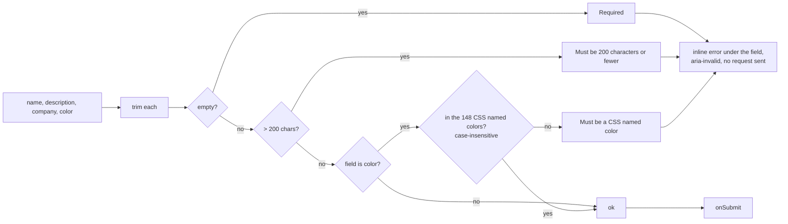

# Architecture

Front end only. Every box below runs in the browser; the only external system is rf-json-server. Rendered SVGs of each diagram are next to this file.

## 1. Module map

Who imports whom. Arrows point from the importer to the module it uses.

## 2. Routes

## 3. Data flow: load and sort

## 4. Data flow: add

## 5. Data flow: delete

## 6. Data flow: update

## 7. Data flow: view one event

## 8. Error handling

Every request goes through one `request()` function. `fetch` only rejects on network failure, so non-2xx responses are turned into errors by hand.

## 9. Validation

Runs on submit, in both the add and edit forms. Same function, same rules.

The requirement-to-file trace is in the README.
